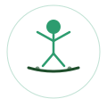

<div align="center">



<br />

# ReBalance

### Objective balance therapy · **~$74 in parts** · **zero bias**

**A pressure-sensitive balance board that turns stroke rehab into an objective, gamified experience — built for the [oSTEM × CPES Hackathon](https://www.calpoly.edu/) at Cal Poly · Spring 2026.**

<br />

[](https://www.calpoly.edu/)
[](https://www.calpoly.edu/)
[](#hardware-build-74)
[](#system-architecture)

<br />

[](https://react.dev/)
[](https://vitejs.dev/)
[](https://tailwindcss.com/)
[](https://www.arduino.cc/)
[](https://developer.mozilla.org/en-US/docs/Web/API/Web_Serial_API)
[](https://ai.google.dev/)
[](LICENSE)

<br />

**Joshua Naim** · **Brian Li**

<br />

[The problem](#the-problem) · [What we built](#what-we-built) · [Tech stack](#tech-stack) · [Architecture](#system-architecture) · [Hardware (~$74)](#hardware-build-74) · [Quick start](#quick-start) · [Clinical objectivity](#clinical-objectivity)

</div>

---

## The problem

Balance therapy after stroke is **subjective, boring, and expensive.**

<table align="center">
<tr>
<td align="center"><h2>800K</h2>strokes per year<br/><sub>in the United States</sub></td>
<td align="center"><h2>30%</h2>therapy compliance<br/><sub>by month 3</sub></td>
<td align="center"><h2>$14,000</h2>typical cost<br/><sub>of clinical balance systems</sub></td>
</tr>
</table>

Patients need **repeatable feedback** and motivation to keep practicing. Clinicians need **objective metrics**, not guesswork. And the system should not demand a cloud stack, a $14k cart, or data that has nothing to do with balance.

---

## What we built

**ReBalance** is a pressure-sensitive balance board paired with a **React dashboard** that reads live weight distribution over USB and turns it into therapy you can measure.

<table>
<tr>
<td align="center" width="25%">
<h3>⚖️</h3>
<b>Live Balance</b><br/>
<sub>Real-time left/right weight distribution and balance score</sub>
</td>
<td align="center" width="25%">
<h3>🎮</h3>
<b>Balance Games</b><br/>
<sub>Therapeutic games controlled by shifting your weight</sub>
</td>
<td align="center" width="25%">
<h3>📈</h3>
<b>Progress Tracking</b><br/>
<sub>Session history and improvement over time</sub>
</td>
<td align="center" width="25%">
<h3>🤖</h3>
<b>AI Analysis</b><br/>
<sub>Objective clinical notes from pure sensor data</sub>
</td>
</tr>
</table>

> **Judges & reviewers:** Click **Try Demo Mode** in the app — no board required. Every tab works with simulated pressure data.

---

## Tech stack

<table>
<tr>
<td width="50%" valign="top">

### Software

| Layer | Technology |
|-------|------------|
| **UI** | [React 19](https://react.dev/) + [Vite 8](https://vitejs.dev/) |
| **Styling** | [Tailwind CSS 4](https://tailwindcss.com/) |
| **Charts** | [Recharts 3](https://recharts.org/) |
| **Games** | HTML5 Canvas (`gameRenderer.js`, HiDPI canvas) |
| **Browser I/O** | [Web Serial API](https://developer.mozilla.org/en-US/docs/Web/API/Web_Serial_API) (Chrome / Edge) |
| **Storage** | `localStorage` — sessions, profile, calibration |
| **AI** | [Google Gemini 2.5 Flash](https://ai.google.dev/) |
| **Quality** | [Vitest](https://vitest.dev/) · Testing Library · [fast-check](https://fast-check.dev/) |

</td>
<td width="50%" valign="top">

### Hardware

| Component | Role |
|-----------|------|
| **4× FSR sensors** (RP-S40-ST) | Pressure detection under the board |
| **Arduino UNO R3** (ELEGOO) | Aggregates readings → serial stream ~**20 Hz** |
| **USB cable** (~6 ft) | Power + data to the laptop |
| **Breadboard + jumpers** | Prototype wiring |
| **Custom board + liner** | Patient-facing standing surface |

**Total prototype cost: ~$74** — see [bill of materials](#hardware-build-74).

</td>
</tr>
</table>

### Design principles (from our hackathon pitch)

| Principle | How ReBalance delivers |
|-----------|------------------------|
| **No backend** | Everything runs in the browser; data stays on-device |
| **No WiFi / Bluetooth / cloud** | USB cable only — plug in and go |
| **Zero bias** | Therapy-relevant data only; AI grounded in sensor metrics |
| **Cost-effective** | Clinical-grade *feedback loop* at hobbyist BOM cost |

---

## System architecture

```
  ┌─────────────┐     ┌─────────────┐     ┌─────────────┐     ┌─────────────────────┐
  │  4 × FSR    │     │  Arduino    │     │  USB cable  │     │  Chrome + React     │
  │  sensors    │ ──► │  Uno R3     │ ──► │  (6 ft)     │ ──► │  Web Serial API     │
  │  pressure   │     │  ~20 Hz     │     │             │     │  dashboard + AI     │
  └─────────────┘     └─────────────┘     └─────────────┘     └─────────────────────┘
```

**No WiFi · No Bluetooth · No cloud · No backend · Just a cable.**

| Stage | Detail |
|-------|--------|
| **Sensors** | Four force-sensitive resistors detect foot pressure |
| **MCU** | Firmware sums left/right channels → `left,right` lines over serial |
| **Transport** | Web Serial @ **9600 baud**, newline-delimited (`BALANCEBACK_READY` handshake) |
| **App** | `useSerial` → `balanceCalc` → live UI, sessions, games, optional Gemini chat |

```
                    ┌──────────────────────────────────────┐
                    │      ReBalance React Dashboard        │
                    │  Home · Game · Sessions · Progress    │
                    │  Profile · TherapyChat (Gemini)       │
                    └──────────────────┬───────────────────┘
                                       │ USB
                                       ▼
                    ┌──────────────────────────────────────┐
                    │  Arduino UNO + 4× FSR balance board   │
                    └──────────────────────────────────────┘
```

---

## Hardware build (~$74)

Cost-effective prototyping with high-fidelity sensor integration and few parts.

| Category | Item | Cost |
|----------|------|------|
| MCU | Arduino ELEGOO UNO R3 | $16.99 |
| Sensors | 4× FSR (RP-S40-ST) | $23.98 |
| Wiring | Breadboard + jumper wires | $9.99 |
| Connection | USB cable | $5.99 |
| Build | Local supplies (tape, liner) + board | ~$27 |
| **Total** | | **~$74** |

### Serial protocol (firmware ↔ app)

| Line | Meaning |
|------|---------|
| `BALANCEBACK_READY` | Board ready |
| `1234,5678` | Left and right pressure integers |

Calibration in-app: stand centered **5 seconds** → baseline saved to `localStorage` for accurate L/R percentages.

---

## Quick start

### Run the dashboard

```bash
git clone https://github.com/joshnaim1/balanceback.git
cd balanceback
npm install
npm run dev
```

Open in **Chrome** or **Edge** → use **Try Demo Mode** or **Connect Board**.

| Step | Action |
|------|--------|
| 1 | **Demo mode** — try the full UX without hardware |
| 2 | Complete the **getting started** wizard |
| 3 | **Sessions** — start a timed balance session |
| 4 | **Game** — play Balance Training, Balance Bird, or Balance Jump |
| 5 | **Progress** — view charts after logging data |

### Optional: AI features

```bash
# .env.local
VITE_GEMINI_API_KEY=your_key_here
```

### Scripts

```bash
npm run build    # production bundle
npm run test     # Vitest + property tests
npm run lint     # ESLint
```

---

## Clinical objectivity

> **The board doesn't read charts. It reads pressure.**

| | |
|---|---|
| **Measures balance with sensors** | Not therapist judgment alone |
| **Captures therapy-relevant data only** | No demographics, identity, or unrelated history in the AI context |
| **AI clinical notes** | Generated from pure sensor data — *numbers in, insight out* |

| We collect | We do **not** collect |
|------------|----------------------|
| Display name, optional pronouns | Legal sex, gender marker |
| Stroke/injury date, affected side | Gender-affirming care history |
| Therapy goals, session feelings | Unrelated medical / EHR data |
| Balance scores, L/R %, duration | Pharmacy, billing, insurance |

All records stay in **`localStorage`** on the patient's machine. Export JSON anytime. See in-app **Data Transparency** (🛡️) and `AISourceDisclosure` on AI-generated notes.

> **Disclaimer:** ReBalance is a hackathon prototype for balance practice and education. It is **not** FDA-cleared and does **not** replace licensed clinical care.

---

## Project structure

```
src/
├── App.jsx                 # Shell, tabs, wizard, calibration
├── components/             # Games, SessionLog, ProgressChart, HomePage, …
├── hooks/                  # useSerial, useGameLoop, useReducedMotion, …
└── utils/                  # balanceCalc, storage, sessionAnalytics
```

Accessibility specs: `.kiro/specs/ui-accessibility-improvements/`

---

## Hackathon

| | |
|---|---|
| **Event** | **oSTEM × CPES Hackathon** |
| **Host** | Cal Poly |
| **Season** | Spring 2026 |
| **Team** | Joshua Naim & Brian Li |
| **Tagline** | *$74 in parts. No backend. No bias.* |

---

## License

[MIT License](LICENSE) — Copyright © 2026 Brian Li and Joshua Naim
